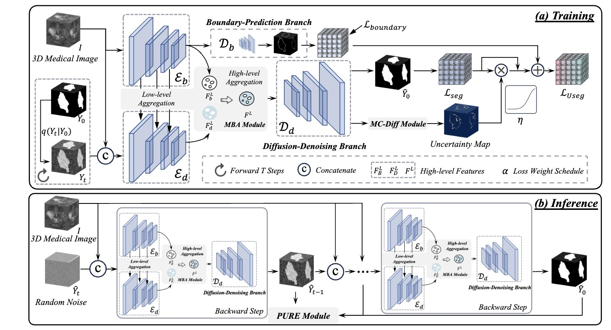

# Diff-UNet: A Diffusion Embedded Network for Robust 3D Medical Image Segmentation



- We devise a Multi-granularity Boundary Aggregation (MBA) module to introduce boundary features into the diffusion model for leveraging boundary information to improve the 3D segmentation accuracy.
%offering feature supplementation and boundary perception.

- We propose a Monte Carlo Diffusion (MC-Diff) module, obtaining an uncertainty map during the diffusion training stage to guide the computation of segmentation loss and improve the segmentation on uncertain pixels.
%and increasing focus on uncertain pixels.

- During the diffusion inference stage, we design a Progressive Uncertainty-driven REfinement (PURE) strategy to fuse segmentation results from different inference steps for further boosting 3D medical image segmentation. %the robustness of predictions.


## Environment

- torch 2.1.2
- CUDA 12.2
- monai
- dynamic_network_architectures
- batchgenerator


## AIIB2023 dataset
### Dataset link
[https://codalab.lisn.upsaclay.fr/competitions/13238#learn_the_details-overview](https://codalab.lisn.upsaclay.fr/competitions/13238#learn_the_details-overview)

The data should be placed in ```"./data/raw_data/AIIB23_Train_T1/"```
### How to run

1. run the preprocessing script to generate the normalized and resampled data
    ```bash
    python 1_preprocessing_aiib2023.py
    ```
    After running the script, the preprocessed data will be saved in ```"./data/fullres/train/"```
    
2. train the model 
    ```bash
    python 2_train_diffunet_aiib2023.py
    ```
    The trained model will be saved in ```"./logs/diffunet/model/"```
    Meanwhile, you can use tensorboard to monitor the training process.
    ```bash
    tensorboard --logdir ./logs/diffunet/
    ```
3. inference using the trained model
    ```bash
    python 3_predict_aiib2023.py
    ```
    the inference results will be saved in ```"./prediction_results/diffunet/"```
4. compute the metrics
    ```bash
    python 4_compute_metrics_aiib2023.py --pred=diffunet
    ```

## BraTS2023 dataset
### Dataset link
[https://arxiv.org/pdf/2305.19369](https://arxiv.org/pdf/2305.19369)

The data should be placed in ```"./data/raw_data/ASNR-MICCAI-BraTS2023-GLI-Challenge-TrainingData/"```

### How to run

1. run the preprocessing script to generate the normalized and resampled data
    ```bash
    python 1_rename_mri_data_brats2023.py
    python 2_preprocessing_brats2023.py
    ```
2. train the model 
    ```bash
    python 3_train_diffunet_brats2023.py
    ```
3. inference using the trained model
    ```bash
    python 4_predict_brats2023.py
    ``` 
4. compute the metrics
    ```bash
    python 5_compute_metrics_brats2023.py --pred=diffunet
    ```

To simplify the running process, rather than predict the boundary information, we directly use the segmentation labels in the current version. In the future, we will continue to release more related codes.

## Acknowledgement

- monai: https://github.com/Project-MONAI/MONAI
- nnunet: https://github.com/MIC-DKFZ/nnUNet
- aiib2023: https://github.com/ayanglab/AIIB/tree/main
